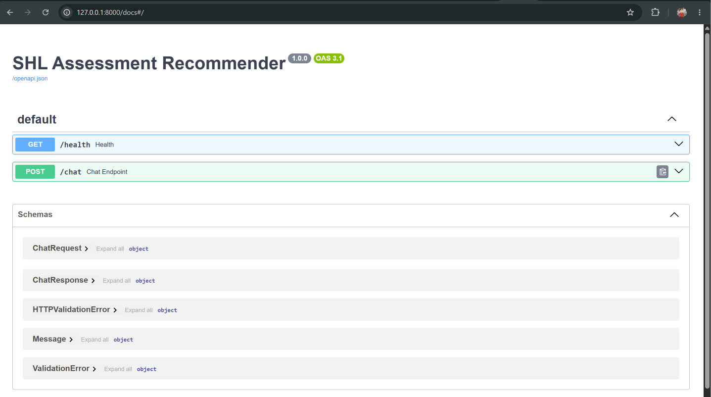
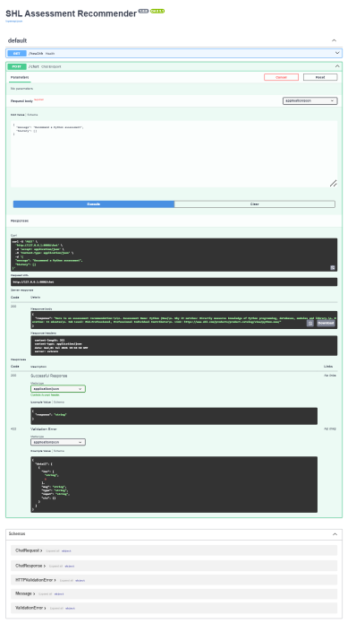

# SHL Assessment Recommender

An AI-powered conversational recommender that suggests the most suitable **SHL assessments** from natural language queries.

The project combines **semantic search (FAISS + Sentence Transformers)** with **Google Gemini** to retrieve relevant SHL assessments and generate intelligent recommendations through a FastAPI REST API.

---

# Features

- Semantic search using FAISS
- Sentence Transformer embeddings
- Google Gemini powered recommendations
- FastAPI REST API
- Interactive Swagger UI
- Natural language assessment search
- Context-aware assessment recommendations

---

# Tech Stack

- Python
- FastAPI
- FAISS
- Sentence Transformers
- Google Gemini API

---

# Project Structure

```text
shl-recommender/
│
├── app.py
├── chat.py
├── recommender.py
├── embeddings.py
├── catalog.py
├── config.py
├── prompts.py
├── requirements.txt
├── data/
│   ├── catalog.json
│   ├── metadata.pkl
│   └── shl.index
│
├── docs/
│   ├── swagger-home.png
│   └── python-recommendation.png
│
└── README.md
```

---

## Installation

```bash
git clone https://github.com/akshaay729-droid/shl-assessment-recommender.git

cd shl-assessment-recommender

pip install -r requirements.txt
```

Create a `.env` file

```env
GEMINI_API_KEY=YOUR_API_KEY
```

Generate the FAISS index (first run only)

```bash
python embeddings.py
```

Run the API

```bash
python -m uvicorn app:app --reload
```

Open Swagger UI

```
http://127.0.0.1:8000/docs
```

# API Endpoints

## Health Check

```
GET /health
```

Returns

```json
{
  "status": "ok"
}
```

---

## Chat Endpoint

```
POST /chat
```

Example Request

```json
{
  "message": "Recommend a Python assessment",
  "history": []
}
```

Example Response

```json
{
  "response": "Here is an assessment recommendation..."
}
```

---

# System Architecture

```text
                User Query
                     │
                     ▼
              FastAPI REST API
                     │
                     ▼
      Sentence Transformer Embedding
                     │
                     ▼
          FAISS Semantic Search
                     │
                     ▼
      Top Matching SHL Assessments
                     │
                     ▼
         Google Gemini LLM
                     │
                     ▼
       Natural Language Recommendation
```

---

# Demo

## Swagger API Documentation



---

## Example Recommendation



---

# Example Queries

- Recommend a Python assessment
- Java assessment under 20 minutes
- Personality assessment for managers
- Assessment for fresh graduates
- SQL assessment
- Leadership assessment
- Cognitive ability assessment

---

# Future Improvements

- Multi-turn conversation support
- Better semantic ranking
- Similarity threshold filtering
- Hybrid keyword + semantic retrieval
- Docker support
- Cloud deployment
- Streaming responses
- Conversation memory

---

# Author

**Akshat Agrawal**

GitHub: https://github.com/akshaay729-droid

LinkedIn: https://www.linkedin.com/in/akshatagrawal/

---

# License

This project was developed for the **SHL AI Intern Take-Home Assignment**.
